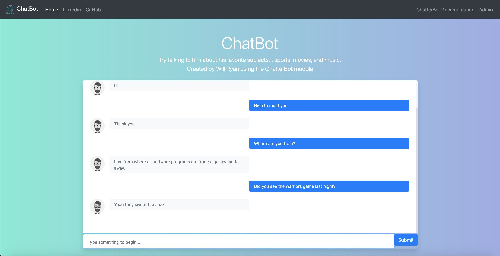

# Chat App

> Django Chat App that uses the Chatterbot module

I will be uploading this to the internet on the domain name techchatbot.com. I am currently
working on figuring out the linux server issues with uploading a Django app.

## Example
> Shows basic front end design




### Requirements

***Django***

***ChatterBot***

```shell script
pip install -r requirements.txt
```

### Training
I compiled the training data mostly from the twitter API and various sources across the
internet. I put them in JSON files in the chat_corpus directory where they are grouped together
by subject


This command will train the bot. It takes approximately 15 - 30 minutes to train. I used
this amount of data because more data will cause performance issues.
```shell script
python manage.py train
```

### How it works

I used the ChatterBot module to handle a great deal of the AI. This bot used training data
to simulation a conversation and learn from from how others speak. It uses a search algorithm
as well as a fitness algorithm to check how correct an answer is. If it cannot find a good result
it will say "I am sorry, but I do not understand."

### Backend

I used Django to handle most of the backend. To train the chatbot I created a custom django-admin
command using train.py located in /chat_app/management/commands.

I also had javascript and JQUERY that communicated with the ChatterbotAPIView.

### Frontend

I used bootstrap to style the navbar and main application interface. It was made to mimic
the look of an iphone chat from imessage.
